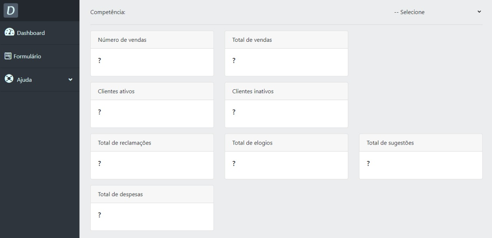
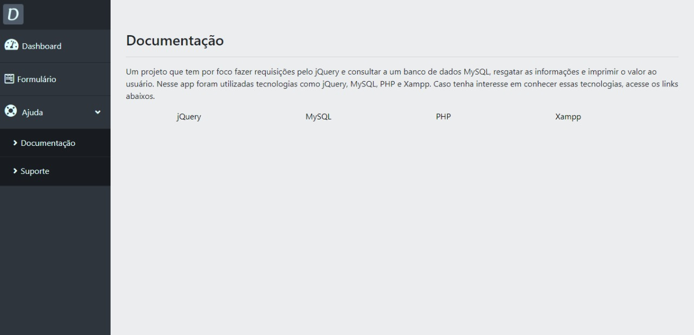

<h1 align="center">
  Dashboard App 
</h1>

<p align="center">
  <a href="#-projeto">Projeto</a>&nbsp;&nbsp;&nbsp;|&nbsp;&nbsp;&nbsp;
  <a href="#-tecnologias-utilizadas">Tecnologias Utilizadas</a>&nbsp;&nbsp;&nbsp;|&nbsp;&nbsp;&nbsp;
  <a href="#-como-executar">Como executar</a>&nbsp;&nbsp;&nbsp;|&nbsp;&nbsp;&nbsp;
  <a href="#-licença">Licença</a>
</p>

<p align="center">
  

<br>

<p align="center">
  
  
  
</p>

## 💻 Projeto

Um projeto que tem por foco fazer requisições pelo jQuery e consultar a um banco de dados MySQL, resgatar as informações e imprimir o valor ao usuário.


## ✨ Tecnologias utilizadas

Esse projeto foi desenvolvido com as seguintes tecnologias:

- [JQuery](https://api.jquery.com/)
- [PHP](https://www.php.net/docs.php)
- [MySQL](https://dev.mysql.com/doc/)
- [Xampp](https://www.apachefriends.org/docs/)

## 🚀 Como executar

- Você precisa instalar o [Xampp](https://www.apachefriends.org/pt_br/index.html) e o [jQuery](https://jquery.com/download/) para executar este projeto.
- Utilize localhost/app_dashboard

**Clone o projeto**

```bash
  git clone https://github.com/kaicLimaOliveira/Dashboard-App-PHP.git
```

## 📄 Licença

Esse projeto está sob a licença MIT. Veja o arquivo [LICENSE](LICENSE) para mais detalhes.

---

<a href="https://kaicLimaOliveira.github.io">
 
 <br />
 <sub><b>Kaic de Lima Oliveira</b></sub></a>

Feito por Kaic de Lima Oliveira 👋🏽 Entre em contato!

[](https://www.facebook.com/kaic.oliveira.587) [](https://www.instagram.com/kaic.lo)
[](mailto:kaic10@outlook.com)
